# LSTM sequence modeling of video data

Trains a combination of a variational autoencoder [1] Kingma 2014 ( http://arxiv.org/abs/1312.6114 ) and LSTM to predict video frames from a sequence of previous frames.

Similar to the approach used by [2] Srivastava 2015 ( http://arxiv.org/abs/1502.04681 ), a sequence of processed image data was used as the input to an LSTM, which was then trained to predict the next frame. The two major differences are that this uses the encoded values Z found by the autoencoder, rather than flattened image data or convolutional percepts, and that one LSTM is used for prediction rather than a separate encoder and decoder.

### Datasets
Two datasets were used, both 64x64:
- moving MNIST similar to [2] generated using moving_mnist.py
- screenshots from the movie Pulp Fiction

### Approaches
####Moving MNIST:
- autoencode to 32-dimensional latent space using a VAE as in [1] with the difference of having a convolutional layer on both the input and output. ( train_vcae.py ) Example outputs, originals on top and reconstructions on the bottom:

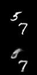
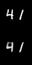
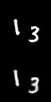
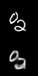

####Pulp Fiction
- training a single autoencoder as above did not work; it never learned to reconstruct beyond light/dark patches
- instead, trained a convolutional autoencoder using MSE reconstruction loss and used its convolutional layers as a feature extractor ( train_cae.py )
- used a VAE as in [1] to encode the extracted features into a 256-dimensional latent space ( train_vae_on_convs.py )
- trained a "deconvoluter" network to reconstruct the original image given the convolutional features ( train_deconv.py )
- so the encoding/decoding steps are: image -> conv_feats -> Z -> conv_feats_reconstructed -> image_reconstructed. Example outputs:

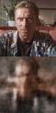
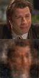
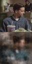
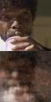
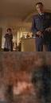
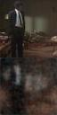

####Video prediction for both datasets:
- PF used a frame skip rate of 3 (so a sequence would be every third frame). MNIST used every frame.
- LSTMs were trained using either MSE loss on Z and Kullback-Leibler divergence on mean/stdev of Z as output by the autoencoder.
- Neither approach predicts video very well; both suffer from noisy output even during the priming sequence and thus performance degrades very quickly (within 2-3 frames) when using the LSTM as a generator.

Examples of Pulp Fiction sampled video sequences - 30 frames of reconstruction from the priming sequence followed by 30 frames of feeding LSTM output into its input:

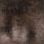
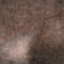
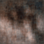
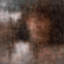
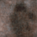
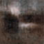

Examples of moving MNIST sampled video:

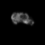
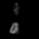
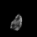
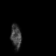
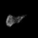
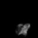

### Future work
- trying to encode the difference in Z-space, which might present some problems as reconstruction error then becomes additive
- using mixture density networks as in [3] Graves 2013 ( http://arxiv.org/abs/1308.0850 )

### Dependencies
- lasagne (current master)
- theano
- tqdm
- h5py
- fuel
